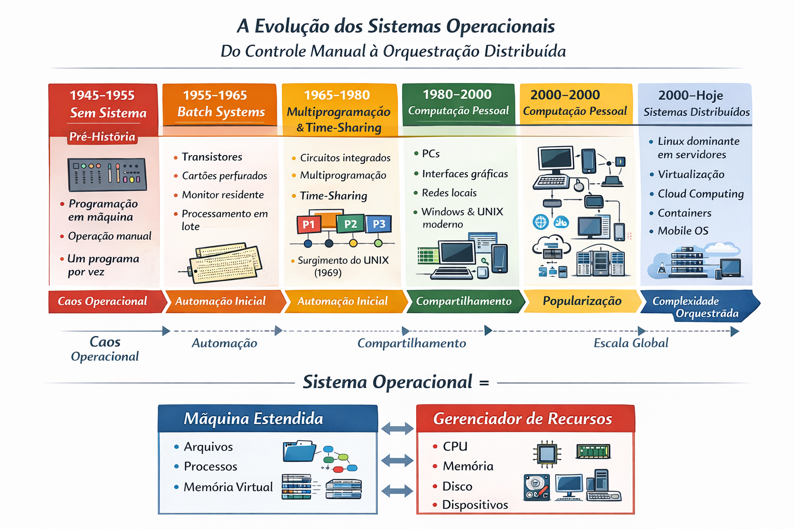

# 📘 Sistemas Operacionais
## Resumo Expandido — Páginas 1–13
Autor: Mauro José dos Santos Filho
Disciplina: Sistemas Operacionais
Semestre: 2026.1


# 📘 Resumo Expandido — Fundamentos de Sistemas Operacionais  
*(Páginas 1–13)*

---

1. Sistema Operacional é software fundamental.
2. Atua entre hardware e usuário.
3. Controla recursos físicos.
4. Fornece abstrações lógicas.
5. Inicia com o boot.
6. Permanece ativo continuamente.
7. Coordena múltiplos programas.
8. Garante isolamento entre processos.
9. Simplifica uso do hardware.
10. Fornece interface padronizada.
11. Hardware é complexo.
12. CPU possui instruções específicas.
13. Memória tem limites físicos.
14. Disco organiza dados fisicamente.
15. Dispositivos variam em velocidade.
16. SO esconde detalhes elétricos.
17. Cria modelo virtual simplificado.
18. Oferece arquivos abstratos.
19. Oferece processos abstratos.
20. Oferece memória virtual.
21. Recursos são limitados.
22. CPU é compartilhada.
23. Memória é compartilhada.
24. Disco é compartilhado.
25. Impressoras são compartilhadas.
26. SO distribui tempo de CPU.
27. SO controla memória.
28. SO organiza disco.
29. SO evita conflitos.
30. SO busca eficiência.
31. Sistema é estruturado em camadas.
32. Hardware forma base.
33. Kernel fica acima.
34. Aplicações acima do kernel.
35. Usuário interage no topo.
36. Aplicações chamam o SO.
37. SO chama hardware.
38. Estrutura reduz complexidade.
39. Estrutura aumenta segurança.
40. Estrutura facilita manutenção.
41. Primeira geração sem SO.
42. Computadores com válvulas.
43. Programação manual direta.
44. Um programa por vez.
45. Operação totalmente física.
46. Segunda geração usa transistores.
47. Surgem sistemas batch.
48. Cartões perfurados dominam.
49. Monitor residente aparece.
50. Execução sequencial automática.
51. Terceira geração integrada.
52. Multiprogramação surge.
53. Vários processos na memória.
54. CPU alterna tarefas.
55. Interrupções são fundamentais.
56. Compartilhamento de tempo.
57. Usuários simultâneos.
58. Terminais interativos.
59. Complexidade aumenta.
60. Gerenciamento melhora.
61. Quarta geração pessoal.
62. Computadores domésticos.
63. Interfaces gráficas.
64. Redes globais.
65. Internet transforma sistemas.
66. Virtualização aparece.
67. Computação em nuvem.
68. Dispositivos móveis.
69. Segurança essencial.
70. Escalabilidade importante.
71. Multiprogramação aumenta uso.
72. CPU evita ociosidade.
73. Processo espera E/S.
74. Outro processo executa.
75. Alternância eficiente.
76. Exige troca de contexto.
77. Estado precisa ser salvo.
78. Estado precisa ser restaurado.
79. Escalonador decide ordem.
80. Critérios variados.
81. Spooling usa disco.
82. Impressão em fila.
83. CPU não espera.
84. Melhor aproveitamento.
85. Buffer intermediário.
86. Processos são programas ativos.
87. Possuem contador de programa.
88. Possuem registradores.
89. Possuem espaço próprio.
90. Possuem controle interno.
91. Estado pode executar.
92. Estado pode esperar.
93. Estado pode bloquear.
94. Transições controladas.
95. Kernel gerencia estados.
96. Escalonamento distribui tempo.
97. Justiça é desejável.
98. Eficiência é necessária.
99. Prioridades podem existir.
100. Preempção é possível.
101. Memória é limitada.
102. Alocação é necessária.
103. Liberação é obrigatória.
104. Proteção é essencial.
105. Processos isolados.
106. Paginação organiza memória.
107. Segmentação divide lógica.
108. Memória virtual expande capacidade.
109. Disco auxilia RAM.
110. Endereçamento virtual abstrai físico.
111. Sistema de arquivos organiza dados.
112. Arquivos têm nomes.
113. Arquivos têm permissões.
114. Diretórios estruturam hierarquia.
115. Acesso precisa controle.
116. Dados devem persistir.
117. Integridade é vital.
118. Compartilhamento controlado.
119. Estrutura em árvore comum.
120. Metadados armazenam informações.
121. E/S é heterogênea.
122. Teclado é lento.
123. Disco é intermediário.
124. CPU é rápida.
125. SO sincroniza velocidades.
126. Drivers controlam dispositivos.
127. Cada dispositivo tem driver.
128. Interrupções notificam eventos.
129. Bufferização melhora fluxo.
130. Abstração padroniza interface.
131. Chamadas de sistema conectam.
132. Programa solicita serviço.
133. Kernel executa operação.
134. Transição muda modo.
135. Modo usuário restrito.
136. Modo kernel privilegiado.
137. Proteção contra abusos.
138. Segurança reforçada.
139. Hardware protegido.
140. Controle centralizado.
141. Kernel é núcleo.
142. Opera em modo privilegiado.
143. Gerencia processos internos.
144. Gerencia memória central.
145. Gerencia dispositivos físicos.
146. Implementa chamadas.
147. Parte crítica do sistema.
148. Falhas são graves.
149. Estabilidade é prioridade.
150. Confiabilidade é exigida.
151. Segurança envolve autenticação.
152. Usuário precisa identificação.
153. Autorização define permissões.
154. Isolamento evita invasões.
155. Controle impede interferência.
156. Sistema precisa robustez.
157. Abstração reduz complexidade.
158. Compartilhamento exige controle.
159. Concorrência exige coordenação.
160. Proteção mantém integridade.
161. Eficiência maximiza uso.
162. Evolução acompanha hardware.
163. Complexidade cresce.
164. SO torna-se sofisticado.
165. Design modular ajuda.
166. Camadas organizam funções.
167. Interface separa níveis.
168. Hardware fica isolado.
169. Aplicações independentes.
170. Padrões facilitam portabilidade.
171. Interrupções suspendem execução.
172. CPU reage a eventos.
173. Sistema salva contexto.
174. Sistema restaura contexto.
175. Processos competem recursos.
176. Deadlocks podem ocorrer.
177. Prevenção é necessária.
178. Sincronização é importante.
179. Seções críticas existem.
180. Exclusão mútua necessária.
181. Escalonamento pode ser justo.
182. Pode ser prioritário.
183. Pode ser circular.
184. Pode ser preemptivo.
185. Decisões impactam desempenho.
186. Memória virtual usa páginas.
187. Página tem tamanho fixo.
188. Tabela de páginas mapeia.
189. Endereço virtual traduzido.
190. Falta de página ocorre.
191. Disco supre memória.
192. Troca de páginas ocorre.
193. Fragmentação pode surgir.
194. Gerenciamento precisa estratégia.
195. Arquivos armazenam dados binários.
196. Sistema registra atributos.
197. Permissões definem acesso.
198. Operações incluem leitura.
199. Operações incluem escrita.
200. Operações incluem exclusão.
201. SO mantém consistência.
202. Sistemas evoluem historicamente.
203. Batch foi inicial.
204. Multiprogramação revolucionou.
205. Time-sharing democratizou.
206. PCs popularizaram.
207. Redes conectaram.
208. Internet globalizou.
209. Virtualização isolou ambientes.
210. Nuvem distribuiu recursos.
211. Kernel pode ser monolítico.
212. Pode ser microkernel.
213. Pode ser híbrido.
214. Estrutura impacta desempenho.
215. Estrutura impacta segurança.
216. SO deve ser escalável.
217. Deve suportar usuários.
218. Deve suportar aplicações.
219. Deve suportar dispositivos.
220. Deve ser atualizável.
221. Hardware evolui rapidamente.
222. SO adapta-se constantemente.
223. Compatibilidade é desejável.
224. Padrões ajudam interoperabilidade.
225. APIs definem contratos.
226. Programas dependem APIs.
227. Estabilidade garante confiança.
228. Falhas comprometem sistema.
229. Monitoramento é importante.
230. Logs registram eventos.
231. Diagnóstico ajuda manutenção.
232. Proteção evita corrupção.
233. Isolamento protege memória.
234. Permissões protegem arquivos.
235. Autenticação protege acesso.
236. Concorrência aumenta complexidade.
237. Sincronização resolve conflitos.
238. Recursos devem ser equilibrados.
239. Justiça evita monopólio.
240. Eficiência reduz desperdício.
241. SO é software central.
242. Ele integra componentes.
243. Ele coordena execução.
244. Ele controla estados.
245. Ele mantém ordem.
246. Ele define prioridades.
247. Ele trata interrupções.
248. Ele gerencia buffers.
249. Ele controla drivers.
250. Ele mantém estabilidade.
251. Abstração é conceito-chave.
252. Gerenciamento é função-chave.
253. Proteção é requisito-chave.
254. Evolução é constante.
255. Processos representam atividades.
256. Threads podem existir.
257. Concorrência amplia desempenho.
258. Paralelismo aproveita múltiplos núcleos.
259. Escalonamento distribui cargas.
260. Balanceamento melhora resposta.
261. Memória virtual amplia ilusão.
262. Endereços virtuais isolam processos.
263. Disco complementa RAM.
264. Sistema decide substituição.
265. Arquivos persistem dados.
266. Diretórios organizam estrutura.
267. Hierarquia facilita navegação.
268. Permissões controlam acesso.
269. E/S sincroniza dispositivos.
270. Drivers traduzem comandos.
271. Kernel centraliza controle.
272. Interface define comunicação.
273. SO abstrai hardware.
274. Usuário abstrai complexidade.
275. Aplicações abstraem tarefas.
276. Sistema integra tudo.
277. História mostra evolução.
278. Necessidade gera inovação.
279. Complexidade exige organização.
280. Organização reduz caos.
281. Controle mantém estabilidade.
282. Gerenciamento evita conflitos.
283. Isolamento protege dados.
284. Estrutura facilita expansão.
285. Modularidade facilita atualização.
286. Padrões facilitam portabilidade.
287. Segurança protege integridade.
288. Concorrência exige disciplina.
289. Interrupções garantem resposta.
290. Contexto preserva execução.
291. Kernel executa privilegiado.
292. Usuário executa restrito.
293. Hardware executa instruções.
294. Sistema coordena camadas.
295. Evolução continua atual.
296. Nuvem redefine limites.
297. Virtualização cria máquinas.
298. Isolamento melhora segurança.
299. Desempenho continua meta.
300. Estabilidade continua meta.
301. Eficiência continua meta.
302. Simplicidade é desejável.
303. Complexidade é inevitável.
304. Abstração reduz impacto.
305. Gerenciamento organiza recursos.
306. Proteção impede abuso.
307. Concorrência amplia uso.
308. Kernel é essencial.
309. Sistema é indispensável.
310. Hardware sozinho é insuficiente.
311. SO torna máquina utilizável.
312. Usuário depende do SO.
313. Aplicações dependem do SO.
314. Recursos dependem coordenação.
315. Evolução acompanha tecnologia.
316. Estrutura garante organização.
317. Escalonador decide execução.
318. Memória virtual amplia espaço.
319. Sistema de arquivos organiza.
320. Drivers controlam dispositivos.
321. Interrupções sincronizam eventos.
322. Spooling otimiza impressão.
323. Multiprogramação maximiza CPU.
324. Batch automatizou tarefas.
325. Time-sharing democratizou acesso.
326. Interfaces gráficas simplificaram uso.
327. Redes expandiram alcance.
328. Internet globalizou serviços.
329. Segurança tornou-se prioridade.
330. Virtualização expandiu possibilidades.
331. Nuvem centralizou infraestrutura.
332. Kernel mantém controle.
333. Usuário mantém interação.
334. Aplicação mantém lógica.
335. Hardware mantém execução.
336. Sistema integra camadas.
337. Organização evita caos.
338. Controle evita desperdício.
339. Proteção evita falhas.
340. Gerenciamento evita conflitos.
341. Evolução continua constante.
342. Tecnologia redefine requisitos.
343. Sistemas adaptam-se.
344. Abstração permanece central.
345. Recursos permanecem limitados.
346. Compartilhamento permanece necessário.
347. Concorrência permanece desafiadora.
348. Segurança permanece crítica.
349. Eficiência permanece objetivo.
350. SO permanece essencial.
351. Base da computação moderna.
352. Fundamento da engenharia.
353. Alicerce de aplicações.
354. Interface entre mundos.
355. Ponte entre lógica e físico.
356. Estrutura organizada.
357. Controle sistemático.
358. Coordenação inteligente.
359. Gerenciamento eficiente.
360. Proteção estruturada.
361. Evolução histórica contextual.
362. Camadas bem definidas.
363. Serviços bem definidos.
364. Responsabilidades claras.
365. Recursos compartilhados.
366. Conflitos potenciais.
367. Soluções estruturadas.
368. Kernel centralizado.
369. Sistema robusto.
370. Execução coordenada.
371. Processos controlados.
372. Memória protegida.
373. Arquivos persistentes.
374. Dispositivos integrados.
375. Interface padronizada.
376. Operação contínua.
377. Inicialização automática.
378. Encerramento controlado.
379. Falhas tratadas.
380. Eventos monitorados.
381. Desempenho avaliado.
382. Uso otimizado.
383. Capacidade ampliada.
384. Complexidade administrada.
385. Ordem mantida.
386. Estrutura preservada.
387. Controle reforçado.
388. Segurança aplicada.
389. Concorrência organizada.
390. Hardware abstraído.
391. Usuário protegido.
392. Aplicação suportada.
393. Recursos distribuídos.
394. Processos sincronizados.
395. Sistema escalável.
396. Arquitetura evolutiva.
397. Projeto modular.
398. Fundamentos consolidados.
399. Conceitos estruturantes.
400. Base para estudos futuros.
401. Introdução estabelece fundamentos.
402. Conceitos definem arquitetura.
403. História explica evolução.
404. Abstração simplifica uso.
405. Gerenciamento coordena recursos.
406. Proteção garante integridade.
407. Concorrência amplia desempenho.
408. Kernel centraliza controle.
409. Sistema operacional é indispensável.
410. Ele sustenta aplicações.
411. Ele organiza hardware.
412. Ele protege usuários.
413. Ele mantém estabilidade.
414. Ele viabiliza computação moderna.
415. Ele permite multitarefa.
416. Ele administra memória.
417. Ele gerencia armazenamento.
418. Ele integra dispositivos.
419. Ele mantém ordem operacional.
420. Ele implementa políticas.
421. Ele aplica regras.
422. Ele monitora execução.
423. Ele registra eventos.
424. Ele responde interrupções.
425. Ele distribui recursos.
426. Ele controla prioridades.
427. Ele mantém isolamento.
428. Ele assegura integridade.
429. Ele suporta crescimento.
430. Ele adapta-se mudanças.
431. Ele estrutura complexidade.
432. Ele transforma hardware bruto.
433. Ele cria ambiente lógico.
434. Ele sustenta inovação.
435. Ele acompanha evolução tecnológica.
436. Ele fundamenta sistemas modernos.
437. Ele integra camadas computacionais.
438. Ele organiza processos concorrentes.
439. Ele coordena múltiplos usuários.
440. Ele protege dados sensíveis.
441. Ele equilibra desempenho.
442. Ele otimiza utilização.
443. Ele mantém estabilidade sistêmica.
444. Ele suporta escalabilidade.
445. Ele viabiliza redes.
446. Ele sustenta virtualização.
447. Ele permite computação distribuída.
448. Ele adapta-se novas demandas.
449. Ele consolida arquitetura.
450. Ele fundamenta engenharia de software.
451. Ele garante interoperabilidade.
452. Ele implementa abstrações essenciais.
453. Ele define contratos de sistema.
454. Ele mantém consistência operacional.
455. Ele coordena recursos finitos.
456. Ele regula concorrência.
457. Ele protege memória física.
458. Ele controla acesso a disco.
459. Ele administra entrada e saída.
460. Ele organiza estrutura de arquivos.
461. Ele implementa chamadas seguras.
462. Ele opera em modo privilegiado.
463. Ele limita modo usuário.
464. Ele mantém hierarquia funcional.
465. Ele integra componentes heterogêneos.
466. Ele sincroniza eventos.
467. Ele gerencia filas.
468. Ele aplica escalonamento.
469. Ele administra buffers.
470. Ele controla drivers.
471. Ele protege integridade estrutural.
472. Ele mantém continuidade operacional.
473. Ele oferece serviços essenciais.
474. Ele organiza arquitetura computacional.
475. Ele sustenta execução simultânea.
476. Ele permite abstração eficiente.
477. Ele coordena múltiplas camadas.
478. Ele mantém estabilidade sistêmica.
479. Ele protege recursos compartilhados.
480. Ele fundamenta sistemas distribuídos.
481. Ele acompanha evolução histórica.
482. Ele responde demandas tecnológicas.
483. Ele estrutura ambiente seguro.
484. Ele organiza execução concorrente.
485. Ele garante acesso controlado.
486. Ele sustenta computação moderna.
487. Ele é núcleo da máquina.
488. Ele conecta software ao hardware.
489. Ele organiza caos computacional.
490. Ele mantém ordem lógica.
491. Ele integra funções complexas.
492. Ele coordena múltiplos recursos.
493. Ele sustenta arquitetura digital.
494. Ele fundamenta engenharia computacional.
495. Ele garante operação confiável.
496. Ele organiza sistemas modernos.
497. Ele protege ambiente computacional.
498. Ele gerencia recursos essenciais.
499. Ele viabiliza multitarefa segura.
500. Sistema Operacional é a base da computação contemporânea.





   # 🧠 Evolução dos Sistemas Operacionais

```mermaid
timeline
    title Evolução dos Sistemas Operacionais

    1945-1955 : Sem Sistema Operacional
              : Programação em máquina
              : Operação manual
              : Um programa por vez
              : Computadores com válvulas

    1955-1965 : Batch Systems
              : Processamento em lote
              : Cartões perfurados
              : Monitor residente
              : Automação inicial

    1965-1980 : Multiprogramação
              : Time-Sharing
              : Interrupções
              : Surgimento do UNIX (1969)
              : Mainframes (IBM System/360)

    1980-2000 : Computadores Pessoais
              : Interfaces gráficas
              : Redes locais
              : UNIX moderno e Windows
              : Popularização da computação

    2000-Hoje : Sistemas Distribuídos
              : Linux dominante em servidores
              : Virtualização
              : Cloud Computing
              : Containers
              : Mobile OS
